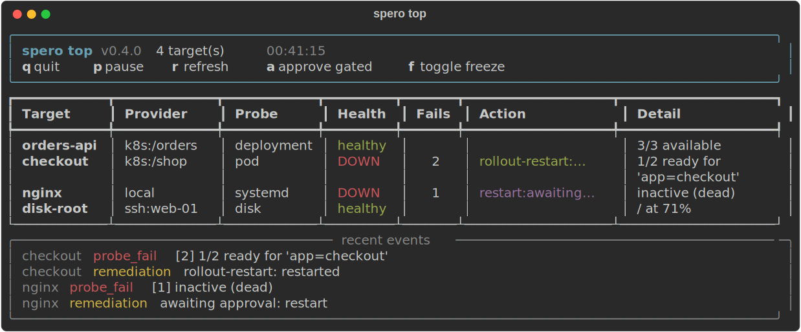

<!--
# -#-#-#-#-#-#-#-#-#-#-#-#-#-#-#-#-#-#-#-#-#-#-#-#-#-#-#-#-#-#-#-#-#-#-#-#-#-#-#-#
# __creation__ = 2026-06-03
# __author__ = "jndjama (Joy Ndjama)"
# __copyright__ = "Copyright 2026 ALTIKVA."
# __licence__ = "MIT & CC BY-NC-SA (https://www.altikva.com/licenses/LICENSE-1.0)"
# -#-#-#-#-#-#-#-#-#-#-#-#-#-#-#-#-#-#-#-#-#-#-#-#-#-#-#-#-#-#-#-#-#-#-#-#-#-#-#-#
# Description: Project README: what Spero is, its concepts, quickstart, and roadmap.
-->

```
 ___ _ __   ___ _ __ ___
/ __| '_ \ / _ \ '__/ _ \
\__ \ |_) |  __/ | | (_) |
|___/ .__/ \___|_|  \___/
    |_|
```

**Self-healing supervision agent for Linux hosts and Kubernetes.**

Spero watches the things you run, processes, services, disks, workloads, notices
when they break, and heals them under policy-governed autonomy. It sits between a
single-host tool like Monit and a full Prometheus + Alertmanager + Ansible stack:
lightweight, agent-based, cluster-aware, with an AI layer for prediction,
root-cause, and policy-gated remediation.



Shipped under [Altikva](https://altikva.com).

> Status: pre-alpha but functional, published on PyPI as `spero` 0.4.0. It
> supervises and heals Linux hosts (local + asyncssh) and Kubernetes (kubectl)
> through one engine, with an AI layer (prediction, root-cause, natural-language
> queries, agentic policy-gated remediation), a control plane with live
> status / metrics / logs, dial-home fleet operation, and pluggable alerting.
> 265 tests, ruff + mypy clean.

## Concepts

Spero is built on four seams so it spans hosts and Kubernetes through one engine:

| Seam | Question | Examples |
|------|----------|----------|
| **Provider** | where things run | `local`, `ssh:[user@]host[:port]`, `k8s:[context][/namespace]` |
| **Probe** | how you know it is healthy | host: process, systemd, port, disk; k8s: pod, deployment, restart-count, resource-usage, pvc, cert-expiry; serverless: keda-scaledobject, knative-service, elpio-\*; data: http, command, postgres, kafka, trino, clickhouse |
| **Remediation** | what to do about it | host: restart, respawn, kill, rotate; k8s: rollout-restart, scale, delete-pod, patch-requests, keda-unpause |
| **Policy** | the declared intent | YAML: target → probe → remediations + autonomy |

Each seam is a registry: add a capability by writing the class and registering it.
Remediations carry an **autonomy** level, `suggest`, `gated`, or `auto`, so low-risk
healing happens on its own while high-risk actions wait for a human (or the AI
approver). Destructive actions (kill, delete-pod, patch-requests) can never be `auto`.

## Install

```bash
pip install spero            # or: uv pip install spero
pip install "spero[ai]"      # Claude-backed AI layer (prediction, root-cause, NL queries)
pip install "spero[k8s]"     # Kubernetes provider deps
pip install "spero[tui]"     # Textual dashboard for `spero top`
pip install "spero[certs]"   # the cert-expiry probe (cryptography)
```

Configuration is env-driven (`SPERO_*` prefix or a `.env` file): `SPERO_POLICY_PATH`,
`SPERO_DATABASE_URL`, `SPERO_HOST`, `SPERO_PORT`, plus the auth / alerting / privacy
knobs below.

## Quickstart

```bash
spero status                       # show targets from the active policy
spero run                          # run one supervision cycle (gated actions wait for a human)
spero run --ai-approve             # agentic: the model decides gated remediations
spero watch                        # supervise continuously, each target on its interval
spero top                          # live k9s-style dashboard (needs the tui extra)
spero heal nginx                   # probe one target, walk its remediations interactively
spero ask "what flapped today?"    # natural-language query over the event history
spero diagnose nginx               # LLM root-cause sketch for a target
spero forecast disk-root           # predictive: when a disk crosses a threshold
spero serve                        # run the control-plane API on :8800
spero --version
```

## Control plane and dashboards

`spero serve` runs a FastAPI control plane that supervises in the background and
exposes its live state over HTTP:

| Endpoint | What |
|----------|------|
| `/health` | liveness (always open) |
| `/status`, `/events` | per-target health + the last action, recent events |
| `/objects/{target}` | the target's underlying object as YAML |
| `/logs/{target}` | last N log lines; `/logs/{target}/stream` follows over SSE |
| `/metrics` | Prometheus text (per-target health and failure counts) |

`spero top` renders a k9s-style live grid of targets and a rolling event feed. With
the `tui` extra it is a full Textual UI (mouse, scrollback, command palette); without
it, a rich.Live fallback. Keys: `a` approve a gated action, `f` toggle the freeze,
`i` inspect YAML, `l` tail logs, `L` follow logs, `s` shell into a pod (local, your
kubectl). `spero top --remote http://host:port` observes a running worker over the
endpoints above instead of probing locally.

Every route except `/health` is guarded by a bearer token when `SPERO_API_TOKEN`
is set (empty means auth off, the localhost default); pass it to an observer with
`spero top --remote <url> --token <token>`.

## Fleet operation (dial-home)

For clusters you cannot reach inbound, run the worker as `spero agent --owner <url>`:
it supervises locally and dials OUT to a `spero owner` service, reporting status and
events on a timer and pulling orders. The owner answers gated remediations as a
remote approver and can push a new policy to a running agent (hot-swapped, no
redeploy). `auto` actions still run if the owner is offline. `SPERO_OWNER_TOKEN`
guards the owner.

## Alerting

Spero fires on first failure and resolves on recovery. `NullAlerter` is the default;
configure email (SMTP with optional STARTTLS + login), a generic JSON webhook
(`SPERO_ALERT_WEBHOOK_URL`), or Slack (`SPERO_SLACK_WEBHOOK_URL`). The channel is
used by `run`, `watch`, `serve`, and the dial-home `agent`.

## Kubernetes deployment

Run spero in-cluster with the Kustomize manifests in `deploy/k8s/`: a supervise-only
`base` (read RBAC, always-on Deployment, default-deny NetworkPolicy) and an `acting`
overlay that opts into remediation with exactly the mutating verbs it needs plus
leader-election leases. The image runs non-root with a read-only root filesystem.
See [deploy/k8s/README.md](./deploy/k8s/README.md).

## Data egress and privacy

With `ANTHROPIC_API_KEY` set, `spero ask`, `spero diagnose`, and `--ai-approve`
send text to Anthropic's API: the question, target names, remediation params, and
recorded event details (which can include command output). Event details are also
stored in the local sqlite database. With no key, spero uses the `NullLLM` fallback
and nothing leaves the host. To scrub likely secrets/PII from event text before it
is sent to the model, set `SPERO_REDACT_EVENTS=1` (best-effort; see
`src/spero/ai/redact.py`). The control-plane endpoints that expose object YAML and
pod logs are token-guarded; see [deploy/k8s/README.md](./deploy/k8s/README.md).

## From source

```bash
git clone https://github.com/altikva/spero && cd spero
uv sync --locked --all-extras
uv run pytest                      # run the suite
```

## License

Spero is released under the **ALTIKVA Dual License v1.0**
([MIT](./LICENSE) and [CC BY-NC-SA 4.0](https://creativecommons.org/licenses/by-nc-sa/4.0/)),
SPDX `MIT AND CC-BY-NC-SA-4.0`. See [LICENSE](./LICENSE).
